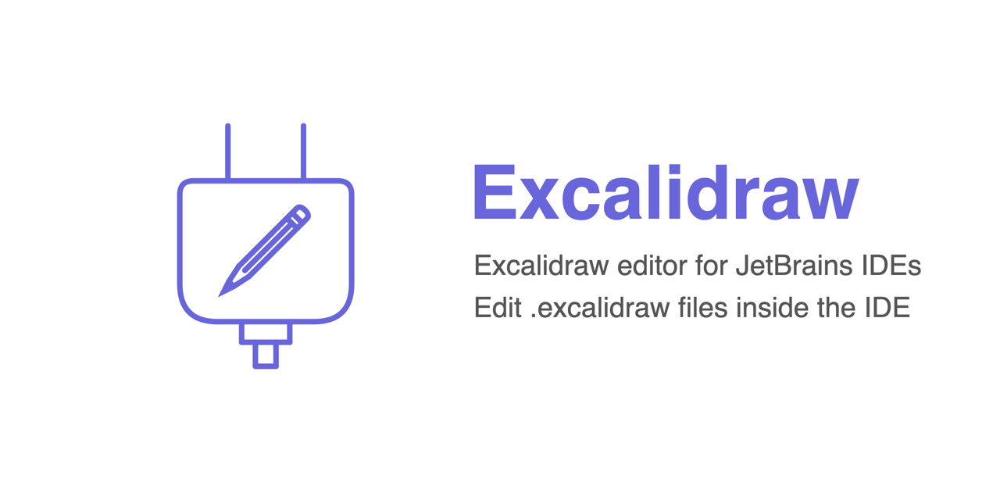
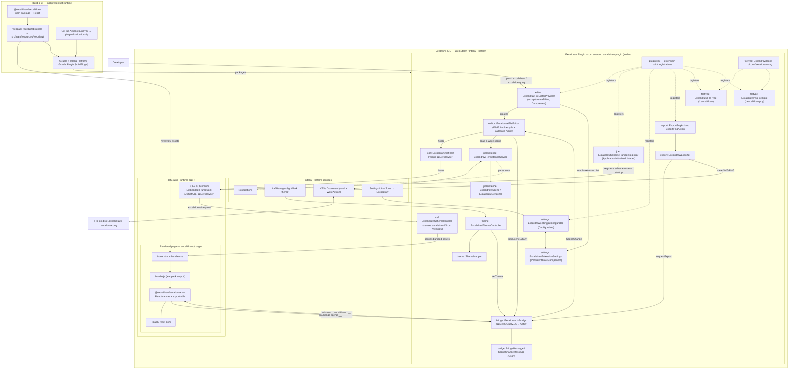

# Excalidraw Plugin for JetBrains IDEs



A plugin for WebStorm and other IntelliJ-platform IDEs that provides a custom
editor for `.excalidraw` and `.excalidraw.png` files. It renders the official
[`@excalidraw/excalidraw`](https://github.com/excalidraw/excalidraw) web app
inside the IDE's embedded **JCEF** (Chromium) browser — the JetBrains analog of
the VSCode Excalidraw plugin.

Open a drawing, edit it on the Excalidraw canvas, and changes are auto-saved
back to the file through the IDE's Virtual File System. The editor follows the
IDE light/dark theme and can export to SVG/PNG. All assets are bundled and run
locally — no drawing data leaves your machine.

## Compatibility

Requires a JetBrains IDE based on **IntelliJ Platform 2026.1 (build 261) or newer**
— WebStorm, IntelliJ IDEA, PyCharm, etc. (`since-build = 261`, no upper bound).

This minimum is required because the plugin relies on platform APIs that are only
public/available from build 261 — notably the public JCEF custom-scheme registration
(`JBCefApp.addCefCustomSchemeHandlerFactory`) used to load the bundled Excalidraw web
app. The IDE must also ship JCEF in its JetBrains Runtime (the default on supported
builds).

## Architecture

High-level view of **every component** involved in opening and rendering a
diagram — the Kotlin plugin modules, the IntelliJ Platform services, the
JetBrains Runtime's embedded JCEF (Chromium) browser, the bundled
`@excalidraw/excalidraw` web app, the JS↔Kotlin bridge, persistence/VFS, and the
build/CI pipeline that produces the bundle.



### Components

**Plugin modules (Kotlin, `com.swaroop.excalidraw.plugin`)**

| Component | Role |
|---|---|
| `plugin.xml` | Declares all extension points: file types, the file-editor provider, the settings `Configurable`, the `ApplicationInitializedListener`, and the export actions. |
| `filetype/ExcalidrawFileType`, `ExcalidrawPngFileType` | Register `.excalidraw` (extension) and `.excalidraw.png` (`*.excalidraw.png` pattern) as Excalidraw file types. |
| `filetype/ExcalidrawIcons` | Loads the bundled official Excalidraw logo (`/icons/excalidraw.svg`) shown for both file types. |
| `editor/ExcalidrawFileEditorProvider` | `FileEditorProvider` (DumbAware) — `accept()` consults the settings service; `createEditor()` builds the editor. |
| `editor/ExcalidrawFileEditor` | The `FileEditor`: hosts the browser, loads/saves the scene, debounced autosave, wires theme + bridge. |
| `jcef/ExcalidrawJcefHost` | Wraps `JBCefBrowser`; loads `excalidraw://app/index.html`; owns the browser lifecycle. |
| `jcef/ExcalidrawSchemeHandlerRegistrar` | `ApplicationInitializedListener` that registers the `excalidraw://` scheme handler once, before JCEF starts. |
| `jcef/ExcalidrawSchemeHandler` | Serves the bundled `/webview` assets over the `excalidraw://` scheme (MIME + CSP). |
| `bridge/ExcalidrawJsBridge` | Kotlin↔JS bridge over `JBCefJSQuery` + `window.__excalidraw*__` functions (load scene, scene change, theme, export, PNG embed/extract). |
| `bridge/BridgeMessage`, `SceneChangeMessage` | Typed messages (de)serialized with Gson. |
| `persistence/ExcalidrawPersistenceService` | Reads/writes the file via the IDE Document/VFS (no `java.io.File`); embeds/extracts the scene for `.excalidraw.png`. |
| `persistence/ExcalidrawScene`, `ExcalidrawSerializer` | Scene data model + canonical `.excalidraw` JSON serialization. |
| `theme/ExcalidrawThemeController`, `ThemeMapper` | Subscribe to `LafManager`; map the IDE theme to the Excalidraw light/dark theme. |
| `export/ExcalidrawExporter`, `ExportSvgAction`/`ExportPngAction` | Export the drawing to SVG/PNG via Excalidraw utilities, saved through the IDE. |
| `settings/ExcalidrawExtensionSettings` | `PersistentStateComponent` holding the configurable extension list (defaults `.excalidraw`, `.excalidraw.png`). |
| `settings/ExcalidrawSettingsConfigurable` | Settings panel under **Tools → Excalidraw**. |

**Host platform & runtime**

| Component | Role |
|---|---|
| IntelliJ Platform | Extension-point framework, VFS/Document, `LafManager`, Notifications, `Configurable`, `PersistentStateComponent`, Actions. |
| JetBrains Runtime (JBR) | Ships **JCEF** (Chromium Embedded Framework) — `JBCefApp`, `JBCefBrowser`, `JBCefJSQuery`. |
| `excalidraw://` scheme | Internal, bundled-only URL scheme — no `http(s)`, no network egress. |

**Bundled web app (`/webview`, served into JCEF)**

| Component | Role |
|---|---|
| `index.html` + `bundle.css` | Entry page and styles (carry the CSP that permits only the local scheme). |
| `bundle.js` | Webpack output containing the React app and the `window.__excalidraw*__` glue (`excalidraw-bundle/src/index.jsx`). |
| `@excalidraw/excalidraw` | The official Excalidraw React canvas + `exportToSvg`/`exportToBlob`/`loadFromBlob` utilities. |
| React / react-dom | Renders the Excalidraw component. |

**Build & CI (produce the bundle/zip; not present at runtime)**

| Component | Role |
|---|---|
| `@excalidraw/excalidraw` npm package | Source dependency bundled by webpack. |
| webpack (`buildWebBundle`) | Builds `excalidraw-bundle/src` → `src/main/resources/webview`. |
| Gradle + IntelliJ Platform Gradle Plugin | `buildPlugin` compiles Kotlin, bundles `/webview`, produces the plugin zip. |
| GitHub Actions (`build.yml`) | Runs `buildPlugin` and uploads `plugin-distribution.zip`. |

## Prerequisites

- **JDK 17** (Temurin recommended) — must match the Gradle build's
  `javaVersion` (see `gradle.properties`).
- **Gradle Wrapper** (`./gradlew`) — bundled in the repo; no separate Gradle
  install needed.
- **Git** — to clone the repository.

The IntelliJ Platform build downloads the WebStorm SDK
(`platformVersion` in `gradle.properties`, currently `2024.1`) automatically on
first build, so an internet connection is required for the initial build.

## Build

From the project root:

```bash
./gradlew buildPlugin
```

This produces the installable plugin distribution at:

```
build/distributions/jetbrains-excalidraw-plugin-<version>.zip
```

(currently `jetbrains-excalidraw-plugin-1.0.0.zip`, where the version comes from
`pluginVersion` in `gradle.properties`).

This is the **same zip** that the CI workflow uploads as an artifact — following
these steps locally reproduces the CI build exactly, because both run
`./gradlew buildPlugin` against the same `gradle.properties` configuration.

> **Local IDE SDK (optional, offline builds):** if you have a JetBrains IDE
> installed and want to build without downloading the SDK, set `localIdePath`
> in `~/.gradle/gradle.properties` (never commit it), e.g.
> `localIdePath=/Applications/WebStorm.app/Contents`. CI leaves this unset and
> resolves the SDK remotely.

## Install (Install Plugin from Disk)

1. Start your JetBrains IDE (WebStorm, IntelliJ IDEA, etc.).
2. Open **Settings/Preferences → Plugins**.
3. Click the **gear icon ⚙** → **Install Plugin from Disk…**.
4. Select the built zip from `build/distributions/`.
5. **Restart the IDE** when prompted.
6. Open any `.excalidraw` or `.excalidraw.png` file — the Excalidraw editor opens.

## Continuous Integration

A GitHub Actions workflow (`.github/workflows/build.yml`) runs on every push,
pull request, and manual dispatch. It builds the plugin with `./gradlew
buildPlugin` and uploads the resulting zip as a downloadable workflow artifact
named **`plugin-distribution`**.

To get a build without compiling locally: open the **Actions** tab on GitHub,
select a successful workflow run, and download the **`plugin-distribution`**
artifact from the run's *Artifacts* section. The downloaded zip installs via
**Install Plugin from Disk** exactly as described above.
